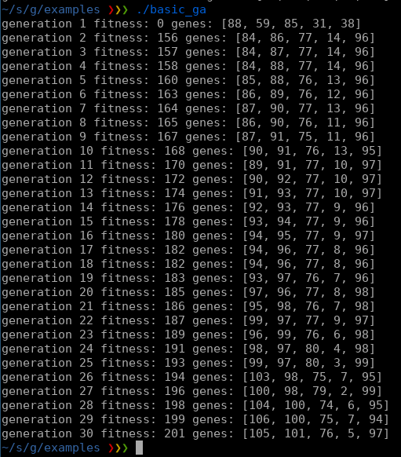

# geneticalg 

This is a basic genetic algorithm library.

The speed depends on the evaluation function, 
basic_ga does a quick evalution and converge in 39,79 millis and about ~40 generations.



### Default values:
	ga.num_generations = 10000
	ga.population_sz = 100
	ga.mutation_probability = 0.5
	ga.mutation_variability = 1
	ga.num_of_genes = 5
	ga.top = 10
	ga.min_gene_value = 0
	ga.max_gene_value = 100
	ga.num_diversity = 5
	ga.random_elements = 3
	ga.max_fitness = 99
	ga.show_top10 = false

### install
    v install sha0coder-V.geneticalg

### usage

Import geneticalg
```V
	import sha0coder_v.geneticalg
```

Create a GA and configure it:

```V
    mut ga := geneticalg.new()
    ga.population_sz = 50
    ga.top = 10
    ga.max_fitness = 200
    ga.num_generations = 10000
```


Add the evaluation function, the result score is stored in gt.fitness, and the genes are on gt.genes[]

```V
	ga.on_evaluation(fn (mut gt geneticalg.Genotype) {
	
    // your evaluation function here

	})
```

If there is a problem but you can messure the distance to the solution, you can optimize the parameters (genes) automatically.

Implement your evaluation function that evaluate the genes and if there is a pattern it will start evolving.


```V
    ga.randomize_population()
    ga.start()
```
